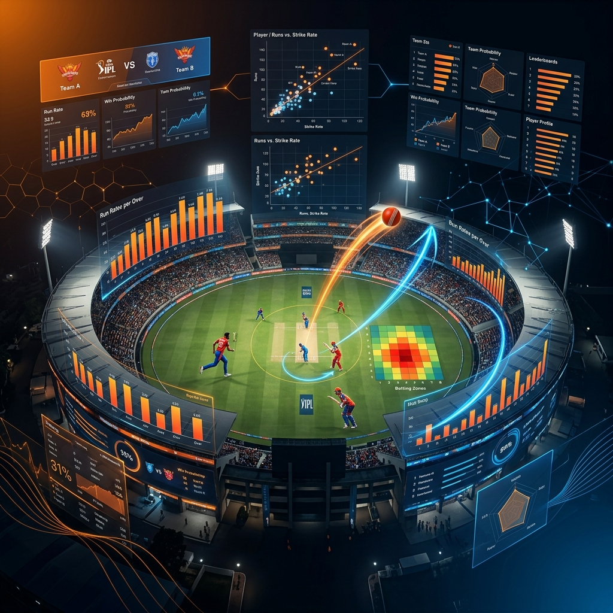

# IPL Analysis (2009–2020) Using Tableau

  

## Overview

An interactive **data visualization project** analyzing a decade of Indian Premier League (IPL) cricket data using **Tableau**. The dashboard uncovers performance trends, team statistics, player insights, and match outcomes across **12 seasons (2009–2020)**.

---

## Live Dashboard

🔗 **View on Tableau Public:** [IPL Analysis Dashboard](https://public.tableau.com/app/profile/srivatsa.g1779/viz/IPLAnalysis2009-2020/Story1)

---

## Key Features

- **Team performance analysis** — Win/loss records, run rates, and season-wise trends
- **Player statistics** — Top batsmen, bowlers, and all-rounders across seasons
- **Match insights** — Toss impact, venue analysis, and margin of victories
- **Interactive filters** — Filter by season, team, player, and venue
- **Story-driven narrative** — Guided Tableau story with key findings

---

## Dashboard Preview

<video src="https://user-images.githubusercontent.com/76219802/214374046-c343b2ca-fa5b-4391-b756-2d32a4f0730c.mp4" controls="controls" style="max-width: 1000px;" autoplay = "autoplay">
</video>

---

## Data Source

**IPL Complete Dataset (2008–2020)**
🔗 [Kaggle Dataset](https://www.kaggle.com/datasets/patrickb1912/ipl-complete-dataset-20082020)

---

## Technology Stack

| Technology | Purpose |
|---|---|
| Tableau Public | Data visualization and dashboarding |
| CSV | Data source format |

---

## Author

**Srivatsa Gorti**

---
